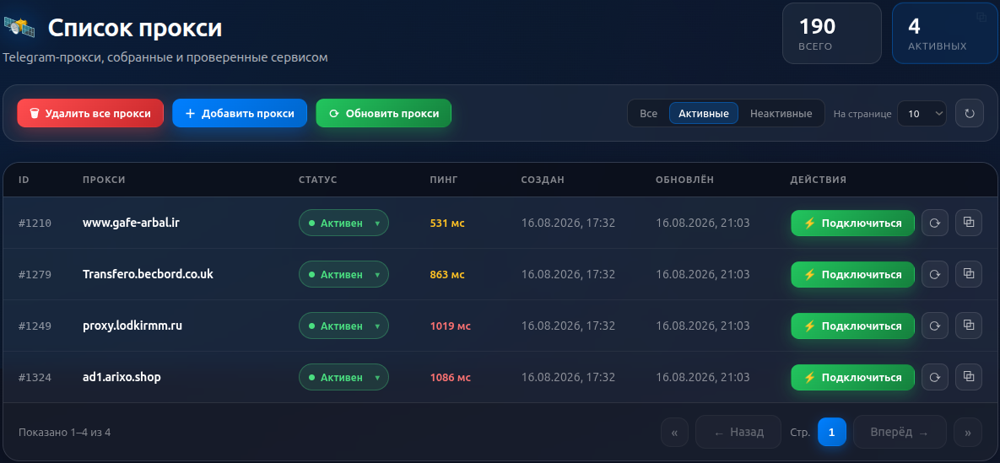

# Proxy telegram checker




## Usefull commands:

```bash
make help
```

## Tests

### Все тесты сразу

Из корня проекта:

```bash
make test
```

### Backend

Тесты написаны на `pytest`, зависимости ставятся через `uv`.

```bash
cd backend
uv sync --all-groups          # установить зависимости (включая dev)

make test                     # все тесты
```

Интеграционным тестам нужна поднятая база данных:

```bash
make up-database              # из корня проекта
```

Дополнительные аргументы для `pytest` передаются через `PYTEST_ARGS`:

```bash
make test PYTEST_ARGS="-k proxy -vv -x"
```

### Frontend

Тесты написаны на `vitest` + `@testing-library/react`.

```bash
cd frontend
npm ci                        # установить зависимости

make test                     # все тесты (одиночный прогон)
make test-watch               # тесты в watch режиме
make test-coverage            # тесты + отчет о покрытии
make typecheck                # проверка типов в коде и тестах
```

## Install & Update

### Install service

```bash
git clone git@github.com:Balshgit/telegram_proxy_checker.git
cd telegram_proxy_checker
sudo rsync -a --delete --progress ./* /opt/gpt_chat_bot/ --exclude .git
cd /opt/telegram_proxy_checker
sudo cp ./envs/.env.template ./envs/.env
sudo cp ./telegram_proxy_checker.service /etc/systemd/system
sudo systemctl enable telegram_proxy_checker.service
sudo systemctl start telegram_proxy_checker.service
```

### Update service

```bash
git pull origin main
sudo rsync -a --delete --progress ./* /opt/telegram_proxy_checker/ --exclude .git
cd /opt/telegram_proxy_checker/
make build-images
sudo systemctl stop telegram_proxy_checker.service
sudo systemctl start telegram_proxy_checker.service
```