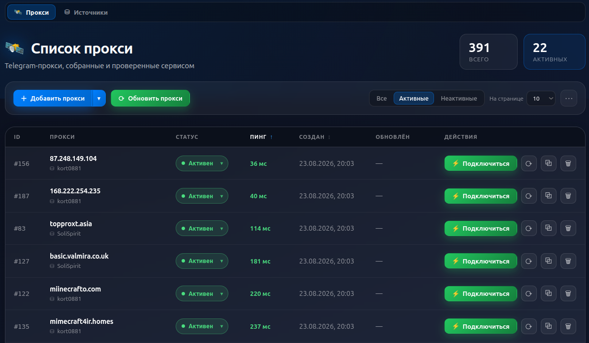
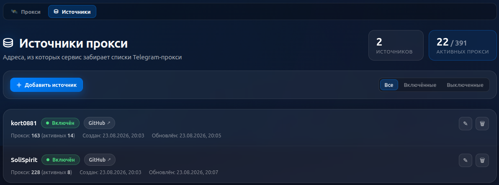

# Proxy telegram checker






## Usefull commands:

```bash
make help
```

## Миграции БД

Схема БД управляется `alembic`. Приложение таблицы не создаёт — миграции нужно накатить до старта.

Конфигурация: `backend/alembic.ini`, скрипты — в `backend/app/infra/migrations/versions`.
DSN берётся из настроек (`envs/.env`), дублировать его в `alembic.ini` не нужно.

Из корня проекта:

```bash
make migrate                        # накатить всё до head
make migration M="add proxy ttl"    # сгенерировать миграцию по diff моделей и БД
```

Из `backend/`:

```bash
make migrate                        # upgrade head (или REV=<revision>)
make migration M="описание"         # revision --autogenerate
make migration-empty M="описание"   # пустая ревизия для data-миграций
make downgrade TO=-1                # откат
make migration-current              # текущая ревизия в БД
make migration-history              # история
make migration-sql                  # SQL без применения
```

Модели для `--autogenerate` собираются автоматически: `load_all_models()` в `env.py` импортирует всё,
что лежит в `app/core/<домен>/models.py` или `app/core/<домен>/models/`. Регистрировать модели вручную не нужно.

Ревизия `0003` — data-миграция: заводит источники прокси по умолчанию (`kort0881`, `SoliSpirit`).

В докере миграции накатываются автоматически перед стартом `server`
(отключается через `RUN_MIGRATIONS=0`), либо отдельной командой:

```bash
docker compose run --rm backend migrate
```

## Tests

### Все тесты сразу

Из корня проекта:

```bash
make test
```

### Backend

Тесты написаны на `pytest`, зависимости ставятся через `uv`.

```bash
cd backend
uv sync --all-groups          # установить зависимости (включая dev)

make test                     # все тесты
```

Интеграционным тестам нужна поднятая база данных:

```bash
make up-database              # из корня проекта
```

Дополнительные аргументы для `pytest` передаются через `PYTEST_ARGS`:

```bash
make test PYTEST_ARGS="-k proxy -vv -x"
```

### Frontend

Тесты написаны на `vitest` + `@testing-library/react`.

```bash
cd frontend
npm ci                        # установить зависимости

make test                     # все тесты (одиночный прогон)
make test-watch               # тесты в watch режиме
make test-coverage            # тесты + отчет о покрытии
make typecheck                # проверка типов в коде и тестах
```

## Install & Update

### Install service

```bash
git clone git@github.com:Balshgit/telegram_proxy_checker.git
cd telegram_proxy_checker
sudo rsync -a --delete --progress ./* /opt/gpt_chat_bot/ --exclude .git
cd /opt/telegram_proxy_checker
sudo cp ./envs/.env.template ./envs/.env
sudo cp ./telegram_proxy_checker.service /etc/systemd/system
sudo systemctl enable telegram_proxy_checker.service
sudo systemctl start telegram_proxy_checker.service
```

### Update service

```bash
git pull origin main
sudo rsync -a --delete --progress ./* /opt/telegram_proxy_checker/ --exclude .git
cd /opt/telegram_proxy_checker/
make build-images
sudo systemctl stop telegram_proxy_checker.service
sudo systemctl start telegram_proxy_checker.service
```